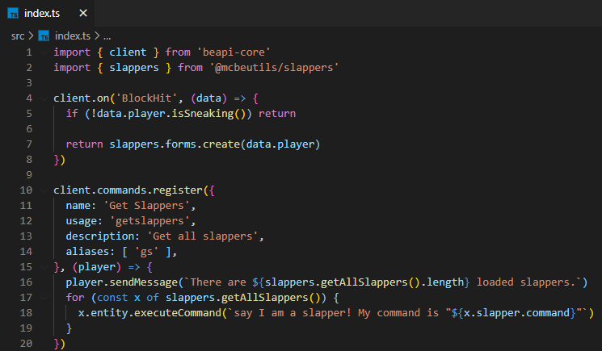

# Slappers

Slappers is a [BeAPI](https://github.com/MCBE-Utilities/BeAPI) module made for creating custom server NPCs. Slappers is a very popular server plugin for both Java Edition and Bedrock Edition of Minecraft. This module allows you to create Slappers that will work on personal worlds and even bedrock realms. Here is a demo of slappers in work. ([Demo](https://www.youtube.com/watch?v=oAnWlLMuHBQ&t=46s))

The module can be either imported as a Minecraft Bedrock Addon or be used within another BeAPI project.

## Installing as an Addon
* Requirements
  * [Minecraft Bedrock ^1.18.20.x](https://minecraft.net/)

To download and install, download the latest .mcpack release from [here](https://github.com/MCBE-Utilities/Slappers/releases/tag/1.0.0).
Once you have downloaded the addon, import the .mcpack into Minecraft Bedrock.
Then, create a new world, or add to existing, and make sure to enable Gametest Framework.
Finally, you now have Slapper installed on your Bedrock world.

To open the creation and edit forms, use the commands listed below.
```
tag @s add "beapi:create_slapper" // Opens slapper creation form
tag @s add "beapi:edit_slapper" // Opens slapper editor form
```
## Installing as a Dependency
* Requirements
  * [node.js](https://nodejs.org/)
  * [BeAPI](https://github.com/MCBE-Utilities/BeAPI)
  * [Minecraft Bedrock ^1.18.20.x](https://minecraft.net/)

To download and install, you can either git clone this repo and use the mcpe pack, or run the command below in your BeAPI project.
```npm install @mcbeutils/slappers```
Once you have done that, you can now import "@mcbeutils/slappers" into your main project.
